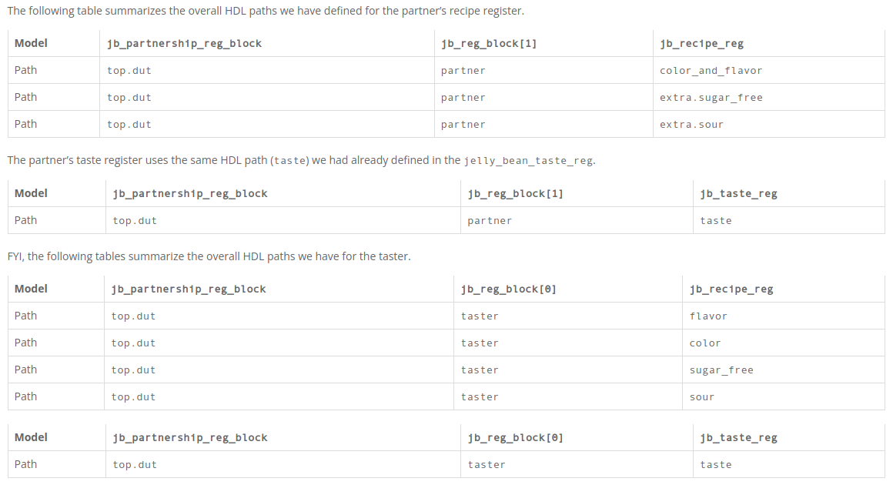

## [UVM Tutorial for Candy Lovers – 29. Backdoor HDL Path](http://cluelogic.com/2015/12/uvm-tutorial-for-candy-lovers-29-backdoor-hdl-path/)

- Partnership module (DUT)\

- Top-level register model\

```verilog
class jelly_bean_partnership_reg_block extends uvm_reg_block;
   `uvm_object_utils( jelly_bean_partnership_reg_block )

   rand jelly_bean_reg_block jb_reg_blocks[2];
   uvm_reg_map               reg_map;

   function new( string name = "jelly_bean_partnership_reg_block" );
      super.new( .name( name ), .has_coverage( UVM_NO_COVERAGE ) );
   endfunction: new

   virtual function void build();
      reg_map = create_map( .name( "reg_map" ), .base_addr( 8'h00 ),
                            .n_bytes( 1 ), .endian( UVM_LITTLE_ENDIAN ) );

      jb_reg_blocks[0] = jelly_bean_reg_block::type_id::create( "jb_reg_blocks[0]" );
      jb_reg_blocks[0].configure( .parent( this ), .hdl_path( "taster" ) );
      jb_reg_blocks[0].build();
      reg_map.add_submap( .child_map( jb_reg_blocks[0].reg_map ), .offset( 0 ) );

      jb_reg_blocks[1] = jelly_bean_reg_block::type_id::create( "jb_reg_blocks[1]" );
      jb_reg_blocks[1].configure( .parent( this ), .hdl_path( "partner" ) );
      jb_reg_blocks[1].build();
      reg_map.add_submap( .child_map( jb_reg_blocks[1].reg_map ), .offset( 2 ) );
   endfunction: build
endclass: jelly_bean_partnership_reg_block


class jelly_bean_base_test extends uvm_test;
   `uvm_component_utils( jelly_bean_base_test )

   jelly_bean_env                   jb_env;
   jelly_bean_env_config            jb_env_cfg;
   jelly_bean_agent_config          jb_agent_cfg;
   jelly_bean_partnership_reg_block jb_partnership_reg_block;

   function new( string name, uvm_component parent );
      super.new( name, parent );
   endfunction: new

   function void build_phase( uvm_phase phase );
      jelly_bean_recipe_reg jb_recipe_reg;

      super.build_phase( phase );
      jb_partnership_reg_block = jelly_bean_partnership_reg_block::type_id::create( "jb_partnership_reg_block" );
      jb_partnership_reg_block.configure( .hdl_path( "top.dut" ) );
      jb_partnership_reg_block.build();
      jb_recipe_reg = jb_partnership_reg_block.jb_reg_blocks[1].jb_recipe_reg; // shorthand
      jb_recipe_reg.clear_hdl_path();
      jb_recipe_reg.add_hdl_path_slice( .name( "color_and_flavor" ), .offset( 0 ), .size( 5 ) );
      jb_recipe_reg.add_hdl_path_slice( .name( "extra.sugar_free" ), .offset( 5 ), .size( 1 ) );
      jb_recipe_reg.add_hdl_path_slice( .name( "extra.sour"       ), .offset( 6 ), .size( 1 ) );
      jb_partnership_reg_block.lock_model(); // finalize the address mapping

   // ... omit ...

endclass: jelly_bean_base_test
```

- The following table summarizes the overall HDL paths we have defined for the partner’s recipe register.


- Log
```
# UVM_INFO sequences.svh(269) @ 0: uvm_test_top.jb_env.jb_agent.jb_seqr@@jb_reg_seq [jelly_bean_reg_sequence] ################ <0> poke_reg ###############
# UVM_INFO verilog_src/uvm-1.2/src/reg/uvm_reg.svh(2684) @ 0: reporter [RegMem] backdoor_write to top.dut.partner.color_and_flavor
# UVM_INFO verilog_src/uvm-1.2/src/reg/uvm_reg.svh(2684) @ 0: reporter [RegMem] backdoor_write to top.dut.partner.extra.sugar_free
# UVM_INFO verilog_src/uvm-1.2/src/reg/uvm_reg.svh(2684) @ 0: reporter [RegMem] backdoor_write to top.dut.partner.extra.sour
# UVM_INFO verilog_src/uvm-1.2/src/reg/uvm_reg.svh(2810) @ 0: reporter [RegModel] Poked register "jb_partnership_reg_block.jb_reg_blocks[1].jb_recipe_reg": 'h000000000000005a
# UVM_INFO sequences.svh(275) @ 10: uvm_test_top.jb_env.jb_agent.jb_seqr@@jb_reg_seq [jelly_bean_reg_sequence] ################ <1> write_reg back-door ################
# UVM_INFO verilog_src/uvm-1.2/src/reg/uvm_reg.svh(2721) @ 10: reporter [RegMem] backdoor_read from %s top.dut.partner.color_and_flavor
# UVM_INFO verilog_src/uvm-1.2/src/reg/uvm_reg.svh(2721) @ 10: reporter [RegMem] backdoor_read from %s top.dut.partner.extra.sugar_free
# UVM_INFO verilog_src/uvm-1.2/src/reg/uvm_reg.svh(2721) @ 10: reporter [RegMem] backdoor_read from %s top.dut.partner.extra.sour
# UVM_INFO verilog_src/uvm-1.2/src/reg/uvm_reg.svh(2753) @ 10: reporter [RegMem] returned backdoor value 0x5a
# UVM_INFO verilog_src/uvm-1.2/src/reg/uvm_reg.svh(2684) @ 10: reporter [RegMem] backdoor_write to top.dut.partner.color_and_flavor
# UVM_INFO verilog_src/uvm-1.2/src/reg/uvm_reg.svh(2684) @ 10: reporter [RegMem] backdoor_write to top.dut.partner.extra.sugar_free
# UVM_INFO verilog_src/uvm-1.2/src/reg/uvm_reg.svh(2684) @ 10: reporter [RegMem] backdoor_write to top.dut.partner.extra.sour
# UVM_INFO @ 10: reporter [RegModel] Wrote register via DPI backdoor: jb_partnership_reg_block.jb_reg_blocks[1].jb_recipe_reg=0x53
# UVM_INFO sequences.svh(281) @ 20: uvm_test_top.jb_env.jb_agent.jb_seqr@@jb_reg_seq [jelly_bean_reg_sequence] ################ <2> reg.write back-door ################
# UVM_INFO verilog_src/uvm-1.2/src/reg/uvm_reg.svh(2721) @ 20: reporter [RegMem] backdoor_read from %s top.dut.partner.color_and_flavor
# UVM_INFO verilog_src/uvm-1.2/src/reg/uvm_reg.svh(2721) @ 20: reporter [RegMem] backdoor_read from %s top.dut.partner.extra.sugar_free
# UVM_INFO verilog_src/uvm-1.2/src/reg/uvm_reg.svh(2721) @ 20: reporter [RegMem] backdoor_read from %s top.dut.partner.extra.sour
# UVM_INFO verilog_src/uvm-1.2/src/reg/uvm_reg.svh(2753) @ 20: reporter [RegMem] returned backdoor value 0x53
# UVM_INFO verilog_src/uvm-1.2/src/reg/uvm_reg.svh(2684) @ 20: reporter [RegMem] backdoor_write to top.dut.partner.color_and_flavor
# UVM_INFO verilog_src/uvm-1.2/src/reg/uvm_reg.svh(2684) @ 20: reporter [RegMem] backdoor_write to top.dut.partner.extra.sugar_free
# UVM_INFO verilog_src/uvm-1.2/src/reg/uvm_reg.svh(2684) @ 20: reporter [RegMem] backdoor_write to top.dut.partner.extra.sour
# UVM_INFO @ 20: reporter [RegModel] Wrote register via DPI backdoor: jb_partnership_reg_block.jb_reg_blocks[1].jb_recipe_reg=0x4c

```

### Compilation and Run options to access backdoor
- Questasim: **+acc** and **+UVM_VERBOSITY=UVM_DEBUG** are must
```bash
vlog design.sv testbench.sv -L ${QUESTA_HOME}/uvm-1.2 -timescale=1ns/1ns +acc
vsim -c work.top -do "run -all; exit" -L ${QUESTA_HOME}/uvm-1.2 +UVM_TESTNAME=jelly_bean_reg_test +UVM_VERBOSITY=UVM_DEBUG
```
- VCS: **-debug_all** and **+UVM_VERBOSITY=UVM_DEBUG** are must
```bash
vcs -licqueue '-timescale=1ns/1ns' '+vcs+flush+all' '+warn=all' '-sverilog' '-debug_all' +incdir+$UVM_HOME/src $UVM_HOME/src/uvm.sv $UVM_HOME/src/dpi/uvm_dpi.cc -CFLAGS -DVCS design.sv testbench.sv
./simv +vcs+lic+wait '+UVM_TESTNAME=jelly_bean_reg_test' '+UVM_VERBOSITY=UVM_DEBUG'
```
